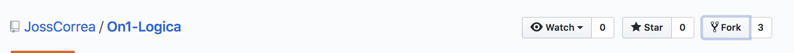
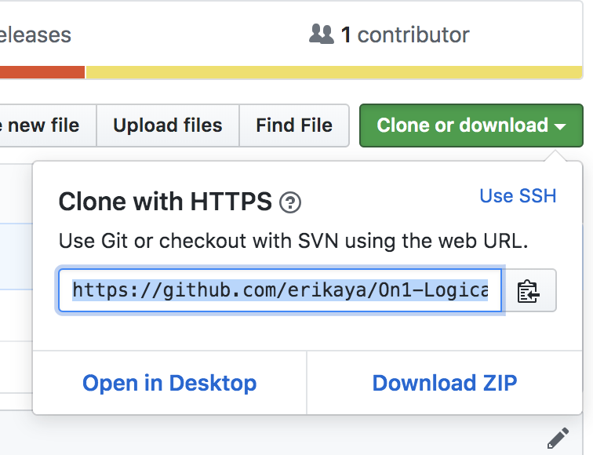
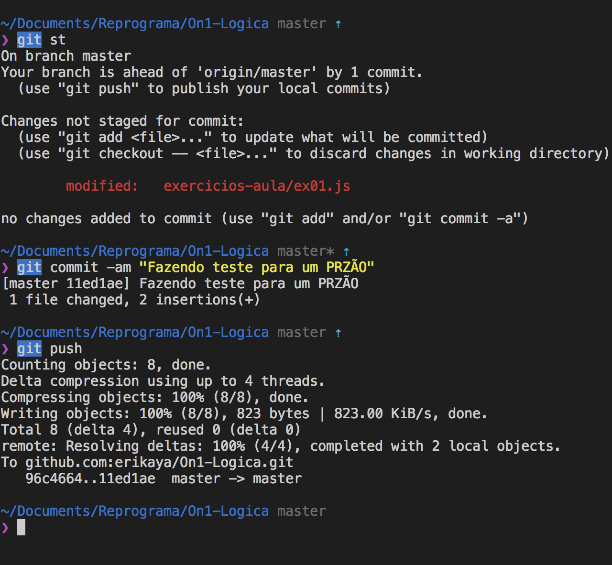
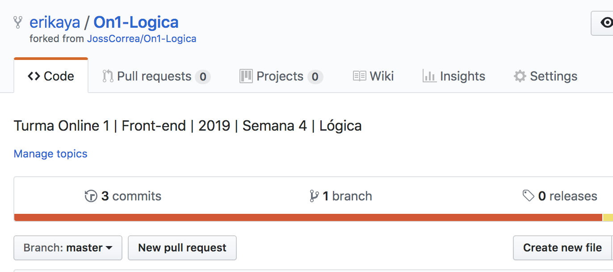
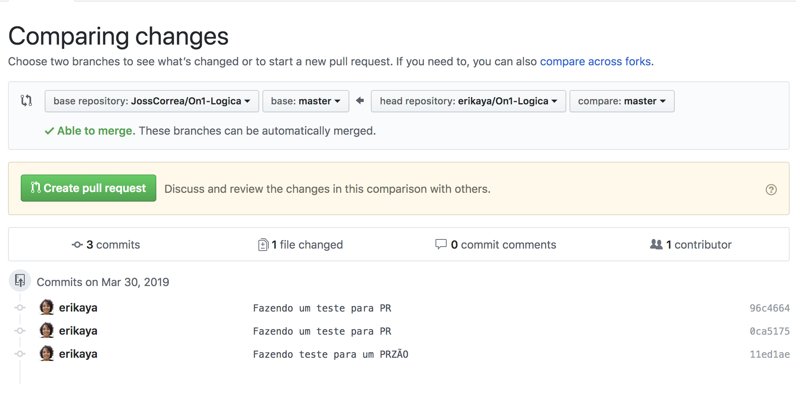

### 1. Clicar na opção **fork** do projeto que contém os exercícios na URL:
https://github.com/JossCorrea/On1-Logica

### 2. Após realizar o **fork**, o projeto é "transferido" para um de seus repositórios. Então provavelmente a sua URL nova ficará da seguinte maneira: https://github.com/{{seu-user}}/On1-Logica

### 3. A partir daí é possível fazer o clone do seu projeto, que foi forkado da Joss:

* Esse **fork** pode ser feito tanto a partir do terminal, com o comando:
  git clone [url-do-seu-projeto]

* Ou através da opção **"Download ZIP"**

### 4. Após abrir o projeto no seu editor de preferência, vamos fazer um teste alterando a linha de qualquer arquivo e subindo pro meu repositório:

a. Primeiramente alterei a linha do arquivo: **ex01.js**

b.Verifiquei como está o status do meu controle de versionamento: **git status**

c.Adicionei o arquivo alterado junto a uma mensagem de commit: 
**git commit -am "Mensagem que você quiser"**

d. Subi as alterações para o meu repositório: **git push**

### 5. Abrindo um Pull Request:
  Para abrir o PR podemos ir até a interface do GitHub, no seu repositório forkado:
  

Selecione a opção: **New pull request**

### 6. Você vai ser redirecionada para o repositório do qual você "forkou" e será possível visualizar a seguinte tela:

Essa tela apresenta a comparação de mudanças entre a branch master do seu repositório (head repository) e a branch master do repositorio da JossCorrea (do qual você forkou - base repository).

Caso seja possível **mergear (Able to merge)**, ou seja, não existem conflitos entre sua versão e a versão da JossCorrea, é só prosseguir a partir do clique no botão **"Create pull request"**. Caso contrário, você terá que resolver os conflitos que possivelmente podem existir entre essas duas **branches**.

